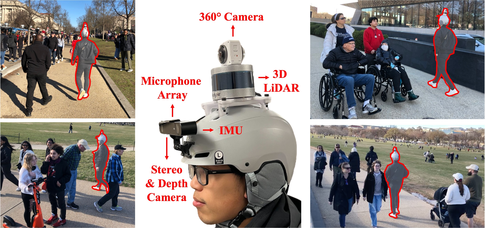
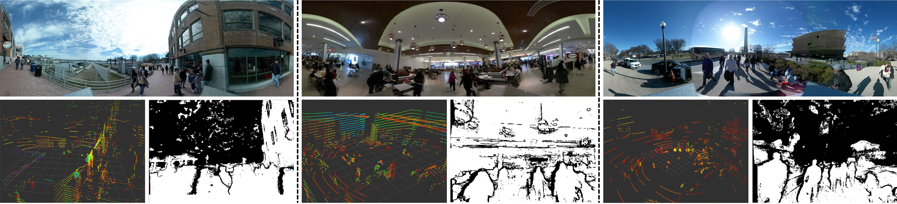

# [MuSoHu](https://cs.gmu.edu/~xiao/Research/MuSoHu/MuSoHu.html): Multi-Modal Social Human Navigation Dataset.



### Dependencies :

> ROS Noetic.

> Python 3.8.10.

> LiDAR driver [Velodyne VLP-16](https://github.com/ros-drivers/velodyne).

> Stereo camera driver [ZED2](https://github.com/stereolabs/zed-ros-wrapper).

### Create a workspace and clone sources

```
mkdir -p catkin_ws/src; cd catkin_ws/src; catkin_init_workspace
git clone https://github.com/ros-drivers/velodyne.git
git clone --recursive https://github.com/stereolabs/zed-ros-wrapper.git
git clone https://github.com/stereolabs/zed-ros-interfaces.git
```

*Install dependencies with* `rosdep` : 
```
cd catkin_ws; rosdep install --from-paths . --ignore-src --rosdistro=noetic
```

### Build and source

```
cd catkin_ws; catkin_make; source devel/setup.bash
```

### Launch visualization: 


In terminal 1 :
```
roslaunch custom_package myLaunch.launch
```

### Record data



In terminal 2 :
```
python3 record.py
```
[Link to TF Tree / URDF](figures/frames.pdf)